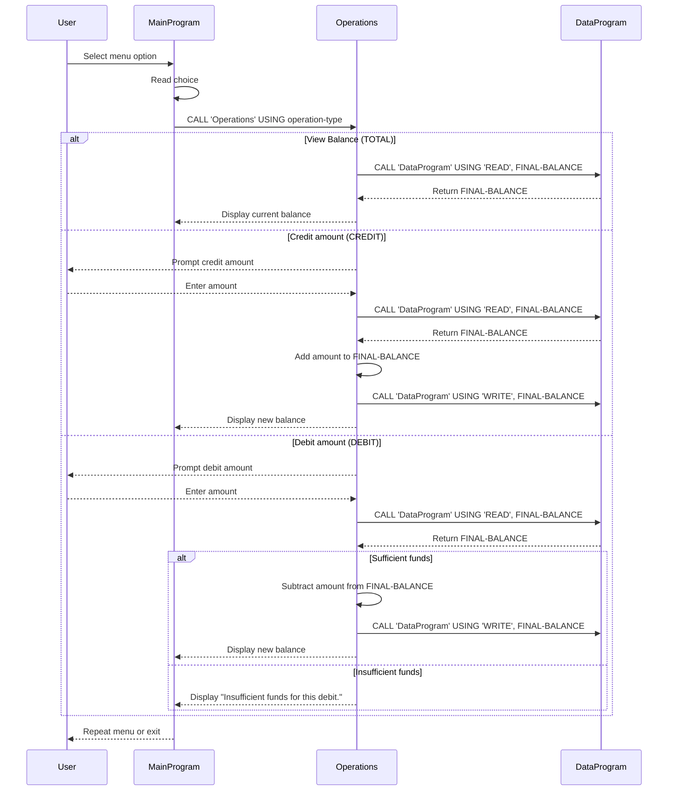

# COBOL Student Account System Documentation

This documentation explains the purpose of each COBOL source file in the `src/cobol` folder, the main program flow, and the key business rules used for managing student accounts.

## Files

### `src/cobol/main.cob`
- Purpose: Main program entry point and user interface.
- Responsibilities:
  - Display a menu to the user.
  - Accept user selection for account operations.
  - Call `Operations` with the requested operation type.
- Key actions:
  - Option 1: View balance.
  - Option 2: Credit account.
  - Option 3: Debit account.
  - Option 4: Exit the system.
- Notes:
  - Invalid menu choices are handled with a prompt to select 1-4.

### `src/cobol/operations.cob`
- Purpose: Business logic for account operations.
- Responsibilities:
  - Interpret operation requests from `MainProgram`.
  - Manage credit, debit, and balance display workflows.
  - Coordinate data reads and writes through `DataProgram`.
- Key functions:
  - `TOTAL`: Reads the current balance and displays it.
  - `CREDIT`: Prompts for an amount, reads the current balance, adds the amount, writes the updated balance, and displays the new balance.
  - `DEBIT`: Prompts for an amount, reads the current balance, and only subtracts the amount if sufficient funds exist.
- Notes:
  - Uses `CALL 'DataProgram' USING 'READ', FINAL-BALANCE` to load balance.
  - Uses `CALL 'DataProgram' USING 'WRITE', FINAL-BALANCE` to persist updated balance.

### `src/cobol/data.cob`
- Purpose: Simulated persistent balance storage and read/write access.
- Responsibilities:
  - Store a working balance value.
  - Provide read access to return the current balance.
  - Provide write access to update the balance.
- Key functions:
  - `READ`: Moves the stored balance into the caller-provided `BALANCE` field.
  - `WRITE`: Updates the stored balance from the caller-provided `BALANCE` field.
- Notes:
  - The internal storage balance is initialized to `1000.00`.
  - This program acts as a simplified data layer for the student account system.

## Business Rules for Student Accounts

- Initial balance is `1000.00`.
- Viewing balance does not modify data.
- Credit operations always increase the account balance by the entered amount.
- Debit operations are only allowed when the account has enough funds:
  - If the requested debit amount is greater than the current balance, the system reports `Insufficient funds for this debit.`
  - No overdraft is permitted.
- The system supports only a single account balance in this legacy example.
- Operation types are passed as fixed-length codes:
  - `TOTAL ` for balance inquiry.
  - `CREDIT` for crediting funds.
  - `DEBIT ` for debiting funds.

## Program Flow Summary

1. `MainProgram` displays a menu and accepts the user's choice.
2. `MainProgram` calls `Operations` with the selected operation type.
3. `Operations` either reads and displays the balance, credits funds, or debits funds.
4. For credit/debit operations, `Operations` uses `DataProgram` to read the current balance, update it, and write the new balance back.
5. The program repeats until the user chooses to exit.

## Sequence Diagram

